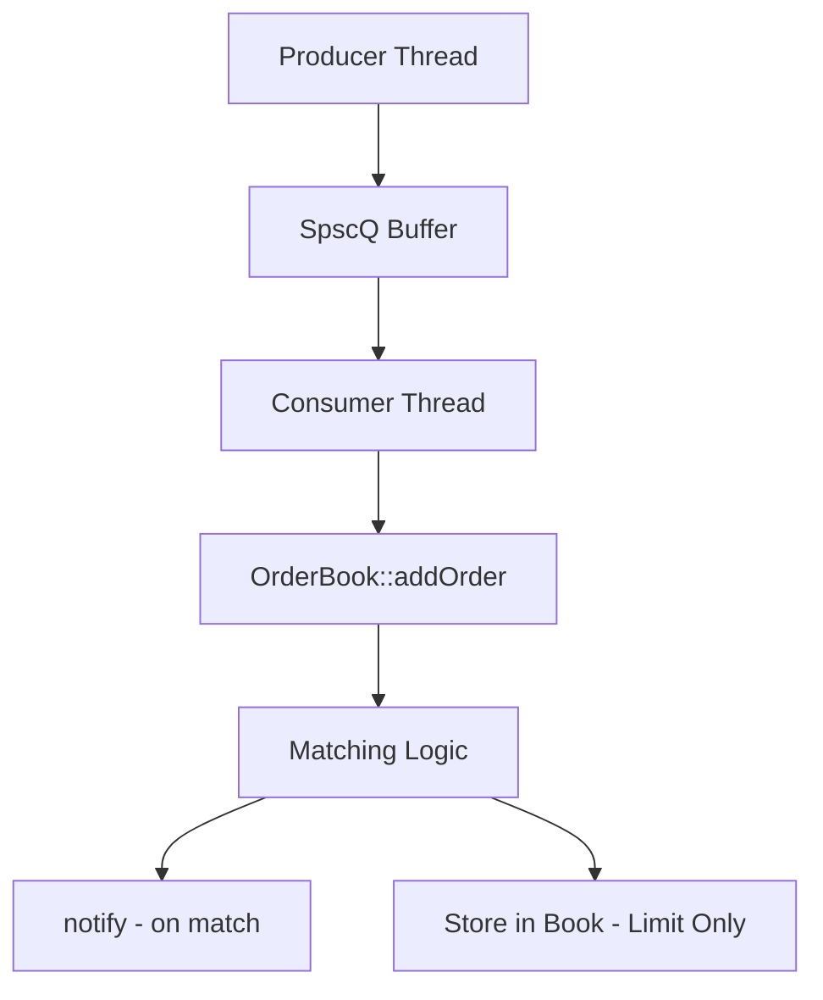

# OrderBook - Low-Latency Matching Engine in C++


> High-performance C++23 order book for simulated trading.  
> Executes core matching logic in **~97ns** (p99 = **560ns**), scaling to **8.5M matches/sec** with flamegraph-guided optimizations.  
> Built with a custom **lock-free SPSC queue** for concurrent order ingestion, validated under load with ASAN/TSAN, and benchmarked across 100M+ orders.

## Purpose

This project is a standalone system built to demonstrate my ability to write low-latency, concurrent code in C++23. It is not intended for production but mirrors real-world design and performance techniques, including benchmarking, profiling, lock-free design, and automated testing.

---------------------
## Key Features

- **Lock-Free Single Producer Single Consumer (SPSC) Queue** – Clean separation of ingestion and matching logic using a wait-free ring buffer with atomic control.
- **Price-Time Priority Matching Engine** – Deterministic order matching based on price, then FIFO time priority, supporting full and partial fills.
- **Multithreaded Test Harness** – Includes thread-level checks such as quantity conservation and checksum validation under concurrency.
- **Extensive Unit Testing with Catch2** – Over 40 targeted assertions covering edge cases, error conditions, and state transitions.
- **Modular CMake Build System** – Structured for independent benchmarking and testing executables, with built-in ASAN/TSAN support for correctness verification.
- **Performance Benchmarking & Profiling** – Includes latency (mean, p99), throughput measurement, and flamegraph analysis to identify hot paths.

---------------------

## Performance Metrics

### Matching Logic

Benchmarked on a Ryzen 7700 with `-O3` optimizations using 10 million market orders and 20 million limit orders. Matching logic was profiled in isolation (pre-ring-buffer integration) to measure raw engine performance.

| Metric                      | Result                  |
|----------------------------|------------------------:|
| Mean latency (market order)| **~97 ns**              |
| 99th percentile latency    | **~560 ns**             |
| Sustained throughput       | **8.5M matches/sec**    |

Memory safety verified with ASAN and TSAN. Performance bottlenecks identified and resolved using `perf` flamegraph profiling (1000Hz sampling).

### Integrated Pipeline: SPSC Queue + Matching Logic

Measures end-to-end latency from when an order enters the SPSC queue until it's matched.  
Latency includes time spent waiting in the buffer — by design — as the queue is long to absorb bursts and avoid drops or backpressure.

| Metric                      | Result                   |
|----------------------------|-------------------------:|
| Mean latency (end-to-end)  | **~1.2 ms**              |
| 99th percentile latency    | **~1.5 ms**              |
| Sustained throughput       | **~14M matches/sec**     |

Tested with 100M orders under load. Producer retries until space is available, ensuring no dropped orders.  
System saturates two CPU cores at 100%, exactly as expected in a true producer-consumer model.  
Correctness validated with ASAN and TSAN; logs confirm full order matching and queue draining.


-----

## System Architecture



The system uses a **lock-free single-producer, single-consumer (SPSC) ring buffer** to separate order ingestion from order processing, improving modularity and enabling future extensibility (e.g., API integration).

The **producer thread** pushes incoming orders into the ring buffer. The buffer is a fixed-size array defined at compile time for performance. When an order is pushed, it overwrites entries that have already been consumed; deletion is unnecessary since the tail simply advances on reads. Both head and tail pointers are atomic to ensure thread safety.

The **consumer thread** continuously reads from the buffer and passes each order to `OrderBook::addOrder`. This triggers the matching logic.

The **matching engine** handles limit and market orders via separate paths:
- **Limit Orders** attempt to cross the book. If unmatched, they are stored in the book.
- **Market Orders** may result in full execution, partial execution, or no execution depending on available liquidity.

This architecture provides a clean separation between input handling and matching logic, allowing for performance optimization and future expansion without tightly coupling components.

**Next steps**: Profiling via flamegraphs has identified the matching logic as the primary performance bottleneck. Optimization efforts will focus there. For added functionality, the most natural extension point is an API layer built on the existing modular boundaries.

------

# Key Components

### Order Class

The `Order` class encapsulates all state and behavior related to a single order, including support for both limit and market types. Orders track execution quantity, price, and unexecuted remainder. The class includes strict error handling to prevent invalid execution (e.g. out-of-the-money limit orders or negative quantities), ensuring robustness in the matching logic. A `notify()` method is available for triggering side effects like external API signals, but is currently disabled to avoid performance interference on the critical path.

### Order Book

The `Book` maintains a sorted map of limit orders on both sides of the market. Orders are stored using `std::map` containers keyed by price, ensuring correct priority by price-time logic. Orders are matched using custom logic for both market and limit types, with support for partial execution. While `std::map` ensures correctness and simplicity, it incurs cache penalties. This is a known tradeoff and a candidate for future refactor based on benchmark insights. 

###  Matching Engine

The matching logic is located in `Book::addOrder` and `marketMatch`, which route incoming orders to the appropriate side of the book and perform matching using price-time priority. The logic supports full, partial, and failed execution outcomes, with consideration of execution paths. Performance benchmarks have identified this logic as the hot path, and future optimisations (e.g. better data structures) are under consideration. All matching paths are unit-tested( including some edge cases) to support safe, iterative refactors.

### Ring Buffer (`SpscQ`)

A lock-free Single Producer Single Consumer (SPSC) queue buffers incoming orders before processing. Built using a fixed-size `std::array` with atomic head/tail pointers, it offers predictable performance and zero locking. The design avoids dynamic allocation and guarantees correctness under high throughput, as verified by TSAN and ASAN. The buffer decouples ingestion from execution and has already sustained **15M orders/sec** under benchmark conditions. Latency, is observed to be dictated by the size of the buffer. To decrease latency, reduce the size of the buffer, but this increases backpressure or number of orders being dropped.

### Producer & Consumer Threads

The producer thread generates or receives orders and pushes them into the ring buffer. The consumer thread pulls from the buffer, subsequently passing orders to the matching engine. This threading model ensures pipeline saturation without risking data races. When the buffer is full, the producer retries in a tight loop; future optimizations may add backoff or scheduling to reduce CPU burn. The architecture is designed to scale with added I/O layers (e.g., API endpoints or socket listeners) without modifying core logic.

### Testing Infrastructure

Unit-tested with Catch2 using helper classes (`TestOrder`, `TestBook`) that expose internal state cleanly. Tests cover invalid states (e.g., negative quantities, exhausted orders), edge cases, and normal flow. TSAN verifies threading correctness. Friend-access methods support safe regression tests during refactor cycles.

###  Benchmarking & Profiling

A full performance test harness measures mean and p99 latency as well as sustained throughput. Results are captured externally and indexed by order ID to avoid introducing data races in the profiling itself. Flamegraphs are generated with `perf` to identify bottlenecks, helping diagnose everything from buffer overhead to I/O costs. The benchmarked system currently achieves **8–15M matches/sec**, depending on config and hardware, with latency as low as **97ns** under O3 optimization.

##  Build & Run Instructions

### Prerequisites

- C++23-compatible compiler (tested with **GCC 13** and **Clang 16**)
- CMake ≥ 3.25
- Catch2 – required to build unit tests
- **libtsan** (for ThreadSanitizer support)  
	Required only when building with `-DENABLE_TSAN=ON`  
	Install via:
	- Ubuntu/Debian: `sudo apt install libtsan0`
	- RHEL/Fedora: `sudo dnf install libtsan`
 - **libasan** (for AddressSanitizer support)  
  Required only when building with `-DENABLE_ASAN=ON`  
  Install via:
  - Ubuntu/Debian: `sudo apt install libasan`
  - RHEL/Fedora: `sudo dnf install libasan`  
    *(you may need a versioned package like `libasan8` if using GCC 13+)*

### Clone and Configure

```bash
git clone https://github.com/giomillsy/OrderBook.git
cd OrderBook
mkdir build && cd build
```

### Build (Release Mode)

```bash
cmake -DCMAKE_BUILD_TYPE=Release ..
make -j$(nproc)
```
    
This builds all targets, including:
- `bookBenchmark` – benchmark executable for latency & throughput
- `orderTests` – unit tests built with Catch2
- `orderBook` – main binary (optional integration wrapper)
  
### Build with Sanitizers (Debug + ASAN/TSAN)

```bash
cmake -DENABLE_TSAN=ON -DCMAKE_BUILD_TYPE=Debug ..
# or
cmake -DENABLE_ASAN=ON -DCMAKE_BUILD_TYPE=Debug ..

# and
make -j$(nproc)
```
This builds all targets, including:

- bookBenchmark – benchmark executable for latency & throughput (in build/benchmarks/)
- orderTests – unit tests built with Catch2 (in build/tests/)
- OrderBook – main binary (optional integration wrapper)

Sanitizers:
- **ASAN**: Detects memory errors (heap/stack)
- **TSAN**: Detects data races in multithreaded code
    

### Run Benchmarks

```bash
./benchmarks/bookBenchmark
```

Benchmarks measure:

- Matching logic latency (mean, p99)
- Throughput with and without SPSC integration
    

### Run Tests

```bash
./tests/orderTests
```

Unit tests cover:
- Matching correctness (market + limit)
- Order edge cases and state transitions
- Threading and buffer integrity

